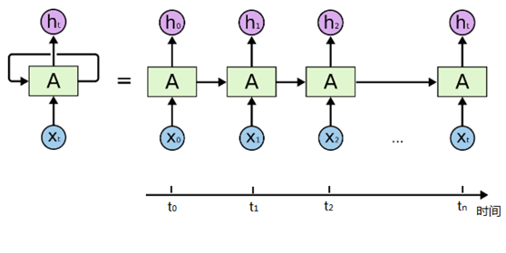
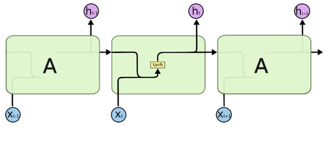
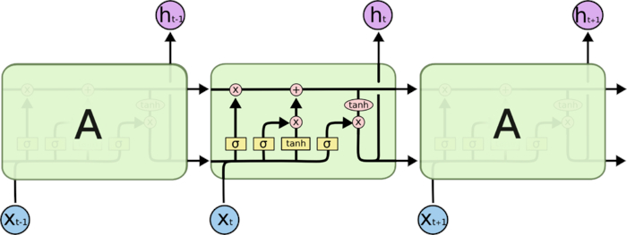
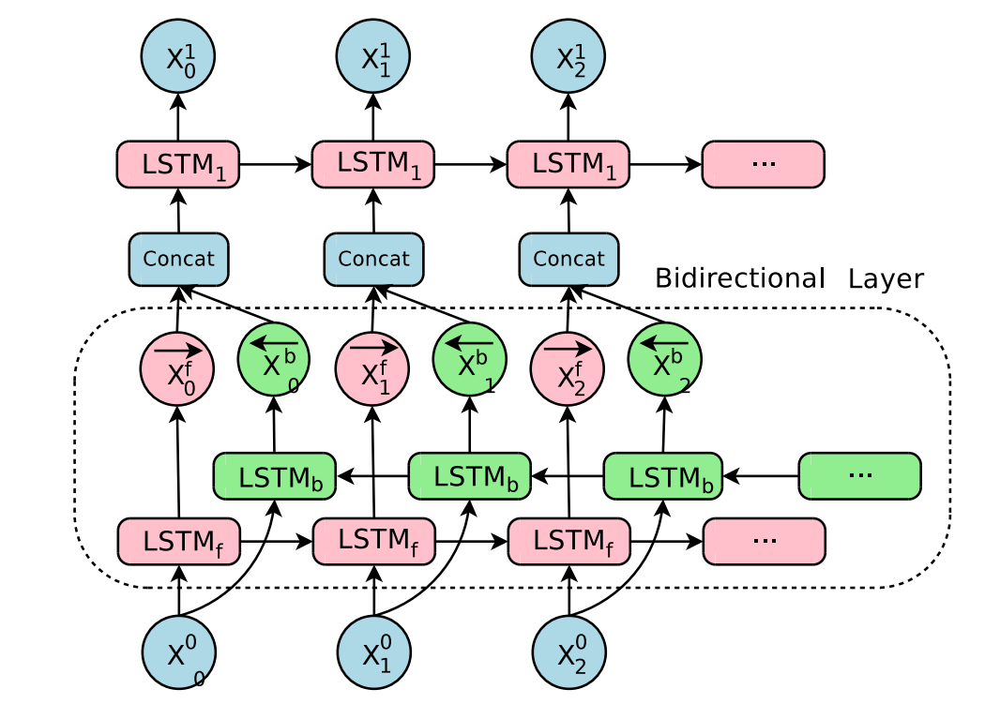

# 循环神经网络

## 目标

1. 能够说出循环神经网络的概念和作用
2. 能够说出循环神经网络的类型和应用场景
3. 能够说出LSTM的作用和原理
4. 能够说出GRU的作用和原理


## 1. 循环神经网络的介绍

为什么有了神经网络还需要有循环神经网络？

在普通的神经网络中，信息的传递是单向的，这种限制虽然使得网络变得更容易学习，但在一定程度上也减弱了神经网络模型的能力。特别是在很多现实任务中，网络的输出不仅和当前时刻的输入相关，也和其过去一段时间的输出相关。此外，**普通网络难以处理时序数据，比如视频、语音、文本等**，**时序数据的长度一般是不固定的**，而前馈神经网络要求输入和输出的维数都是固定的，不能任意改变。因此，当处理这一类和时序相关的问题时，就需要一种能力更强的模型。

循环神经网络（Recurrent Neural Network，RNN）是一类具有短期记忆能力的神经网络。**在循环神经网络中，神经元不但可以接受其它神经元的信息，也可以接受自身的信息，形成具有环路的网络结构**。换句话说：**神经元的输出可以在下一个时间步直接作用到自身**（作为输入）


通过简化图，我们看到RNN比传统的神经网络多了一个循环圈，这个循环表示的就是在下一个**时间步**（**Time Step**）上会返回作为输入的一部分，我们把RNN在时间点上展开，得到的图形如下：

```python
理解：
	# 时刻t1，当前时间步不仅有输入x1，还会有上一个时间步的输出h0
```




或者是：



在不同的时间步，RNN的输入都将与之前的时间状态有关，
$$
t_n
$$
**时刻网络的输出结果是该时刻的输入和所有历史共同作用的结果**，这就达到了对时间序列建模的目的。

RNN的不同表示和功能可以通过下图看出：


- 图1：固定长度的输入和输出 (e.g. 图像分类)
- 图2：序列输出 (e.g.图像转文字)
- 图3：数列输入 (e.g. 文本分类)
- 图4：异步的序列输入和输出(e.g.文本翻译).
- 图5：同步的序列输入和输出 (e.g. 根据视频的每一帧来对视频进行分类)


## 2. LSTM和GRU

### 2.1 LSTM的基础介绍

假如现在有这样一个需求，根据现有文本预测下一个词语，比如`天上的云朵漂浮在__`，通过间隔不远的位置就可以预测出来词语是`天上`，但是对于其他一些句子，可能需要被预测的词语在前100个词语之前，那么此时由于间隔非常大，随着间隔的增加可能会导致真实的预测值对结果的影响变的非常小，而无法非常好的进行预测（RNN中的长期依赖问题（long-Term Dependencies））

那么为了解决这个问题需要**LSTM**（**Long Short-Term Memory网络**）

LSTM是一种RNN特殊的类型，可以学习长期依赖信息。在很多问题上，LSTM都取得相当巨大的成功，并得到了广泛的应用。

一个LSMT的单元就是下图中的一个绿色方框中的内容：




其中
$$
\sigma
$$
表示sigmod函数，其他符号的含义：


```python
Pointwise Operation:  两个对应位置的数据进行操作
Vector Transfer: 表示张量 或 向量的传递
Concatenate: 两个东西合并在一起
Copy: 对结果进行复制，并传入不同的分支
```

### 2.2 LSTM的核心


>   Ct-1 保存的就是记忆
>
>   ​	1.其修改可以通过sigmoid和ft的点乘实现
>
>   遗忘门：通过sigmoid决定哪些信息被遗忘
>
>   输入门：决定哪些信息会被输入
>
>   ​	1.sigmoid：决定输入多少比例的信息
>
>   ​	2.tanh：决定输入什么信息
>
>   输出门：
>
>   ​	1.输出当前时刻的结果和hidden_state
>
>   ​	2.hidden_state == h_t
>
>   输入和输出：
>
>   ​	1.输入：hidden_state, X_t, C_t-1
>
>   ​	2.输出：H_t, H_t, C_t

**LSTM的核心在于单元（细胞）中的状态，也就是上图中最上面的那根线。**

但是<u>**如果只有上面那一条线，那么没有办法实现信息的增加或者删除**</u>，所以在LSTM是通过一个叫做`门`的结构实现，门可以选择让信息通过或者不通过。

这个**门主要是通过sigmoid和点乘**（`pointwise multiplication`）实现的


我们都知道，
$$
sigmoid
$$
的取值范围是在(0,1)之间，如果**接近0表示不让任何信息通过，如果接近1表示所有的信息都会通过**


### 2.3 逐步理解LSTM

#### 2.3.1 遗忘门

**遗忘门通过sigmoid函数来决定哪些信息会被遗忘**

在下图就是
$$
h_{t-1}和x_t
$$
进行合并（concat）之后乘上权重和偏置，通过sigmoid函数，输出0-1之间的一个值，这个值会和前一次的细胞状态
$$
C_{t-1}
$$
进行点乘，从而决定遗忘或者保留


#### 2.3.2 输入门

```python
遗忘门 和 输入门 中两个 sigmoid 的权重是不一样的
```


下一步就是决定哪些新的信息会被保留，这个过程有两步：

1. 一个被称为`输入门`的sigmoid 层决定哪些信息会被更新

2. `tanh`会创造一个新的候选向量
    $$
    \widetilde{C}_{t}
    $$
    ，后续可能会被添加到细胞状态中

例如：

`我昨天吃了苹果，今天我想吃菠萝`，在这个句子中，通过遗忘门可以遗忘`苹果`,同时更新新的主语为`菠萝`


现在就可以更新旧的细胞状态
$$
C_{t-1}
$$
为新的
$$
C_{ t }
$$
 了。

更新的构成很简单就是：

1. 旧的细胞状态和遗忘门的结果相乘
2. 然后加上输入门和tanh相乘的结果


#### 2.3.3 输出门

最后，我们需要决定什么信息会被输出，也是一样这个输出经过变换之后会通过sigmoid函数的结果来决定那些细胞状态会被输出。


步骤如下：

1. 前一次的输出和当前时间步的输入的组合结果通过sigmoid函数进行处理得到
    $$
    O_t
    $$
    

2. 更新后的细胞状态
    $$
    C_t
    $$
    会经过tanh层的处理，把数据转化到(-1,1)的区间

3. tanh处理后的结果和
    $$
    O_t
    $$
    进行相乘，把结果输出同时传到下一个LSTM的单元


### 2.4 GRU，LSTM的变形

```python
两个门：更新门和输出门
输入和输出：
	1.两个输出：hidden_state, hidden_state
  2.两个输入：x_t, hidden_state_t-1
```


**GRU(Gated Recurrent Unit),是一种LSTM的变形版本， 它将遗忘和输入门组合成一个“更新门”**。它还**合并了单元状态和隐藏状态**，并进行了一些其他更改，由于他的模型**比标准LSTM模型简单**，所以越来越受欢迎。


LSTM内容参考地址：https://colah.github.io/posts/2015-08-Understanding-LSTMs/

## 3. 双向LSTM

单向的 RNN，是根据前面的信息推出后面的，但有时候只看前面的词是不够的， 可能需要预测的词语和后面的内容也相关，那么此时需要一种机制，能够让模型不仅能够从前往后的具有记忆，还需要从后往前需要记忆。此时双向LSTM就可以帮助我们解决这个问题



由于是双向LSTM，所以每个方向的LSTM都会有一个输出，最终的输出会有2部分，所以往往需要concat的操作