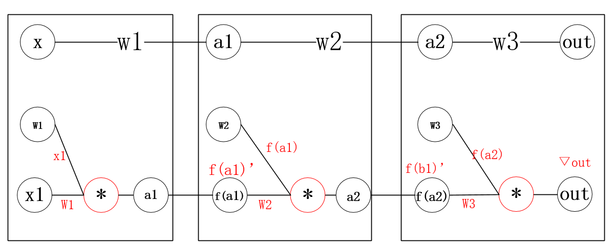
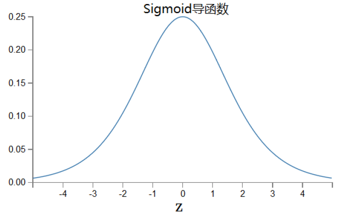
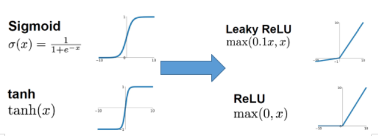

# Pytorch中的序列化容器

## 目标

1. 知道梯度消失和梯度爆炸的原理和解决方法
2. 能够使用`nn.Sequential`完成模型的搭建
3. 知道`nn.BatchNorm1d`的使用方法
4. 知道`nn.Dropout`的使用方法

## 1. 梯度消失和梯度爆炸

在使用pytorch中的序列化 容器之前，我们先来了解一下常见的梯度消失和梯度爆炸的问题

### 1.1 梯度消失

```python
'''
	梯度太小，无法进行参数的更新，梯度小到数据类型无法表示出现Nan
'''
```

假设我们有四层极简神经网络：每层只有一个神经元



$$
获取w1的梯度有：▽w1 = x1*f(a1)’*w2*f(b1)’*w3*▽out
$$
假设我们使用sigmoid激活函数，即f为sigmoid函数，sigmoid的导数如下图



假设每层都取得sigmoid导函数的最大值1/4，那么在反向传播时，$X1=0.5,w1=w2=w3=0.5$

$$
\nabla w1< \frac{1}{2} * \frac{1}{4}* \frac{1}{2}* \frac{1}{4}*\frac{1}{2}*\nabla out = \frac{1}{2^7} \nabla out
$$
当权重初始过小或使用`易饱和神经元(sigmoid,tanh，) sigmoid在y=0,1处梯度接近0，而无法更新参数`，时神经网络在反向传播时也会呈现指数倍缩小，产生“消失”现象。


### 1.2 梯度爆炸

```python
'''
	梯度太大，大到数据类型无法表示，出现Nan
'''
```


假设
$$
X2=2,w1=w2=w3=2​
$$

$$
\nabla w1 = f'{a}*2*f‘{a}*x2\nabla out = 2^3f'(a)^2 \nabla out 
$$

 当权重初始过大时，梯度神经网络在反向传播时也会呈现指数倍放大，产生“爆炸”现象。


### 1.3 **解决梯度消失或者梯度爆炸的经验**

1. **替换易训练神经元**

   

2. **改进梯度优化算法：**使用adam等算法

3. **使用batch normalization**

   ​	加速模型的训练，把参数进行规范化处理，让参数计算的梯度不会过小


## 2. `nn.Sequential`

`nn.Sequential`是一个有序的容器，其中传入的是构造器类(各种用来处理input的类)，最终input会被Sequential中的构造器类依次执行

例如：

```python
layer = nn.Sequential(
            nn.Linear(input_dim, n_hidden_1), 
            nn.ReLU(True)， #inplace=False 是否对输入进行就地修改，默认为False
            nn.Linear(n_hidden_1, n_hidden_2)，
            nn.ReLU(True)，
            nn.Linear(n_hidden_2, output_dim) # 最后一层不需要添加激活函数
             )
```

在上述就够中，可以直接调用layer(x)，得到输出

x的被执行顺序就是Sequential中定义的顺序：

1. 被隐层1执行，形状变为[batch_size,n_hidden_1]
2. 被relu执行，形状不变
3. 被隐层2执行，形状变为[batch_size,n_hidden_2]
4. 被relu执行，形状不变
5. 被最后一层执行，形状变为[batch_size,output_dim]


## 3. `nn.BatchNorm1d`

`batch normalization`  翻译成中文就是批规范化，即在每个batch训练的过程中，对参数进行归一化的处理，从而达到加快训练速度的效果。

以sigmoid激活函数为例，他在反向传播的过程中，在值为0,1的时候，梯度接近0，导致参数被更新的幅度很小，训练速度慢。但是如果**对数据进行归一化之后，就会尽可能的把数据拉倒[0-1]的范围，从而让参数更新的幅度变大，提高训练的速度**。

batchNorm一般会放到激活函数之后，即对输入进行激活处理之后再进入batchNorm

```python
layer = nn.Sequential(
            nn.Linear(input_dim, n_hidden_1),
    		
            nn.ReLU(True)， 
    		nn.BatchNorm1d(n_hidden_1)
    
            nn.Linear(n_hidden_1, n_hidden_2)，
            nn.ReLU(True)，
    		nn.BatchNorm1d(n_hidden_2)

            nn.Linear(n_hidden_2, output_dim) 
             )
```

## 4. `nn.Dropout`

dropout在前面已经介绍过，可以理解为**对参数的随机失活**

1. **增加模型的稳健性**
2. **可以解决过拟合的问题（增加模型的泛化能力）**
3. **可以理解为训练后的模型是多个模型的组合之后的结果，类似随机森林。**

```python
layer = nn.Sequential(
        nn.Linear(input_dim, n_hidden_1),
        nn.ReLU(True)， 
        nn.BatchNorm1d(n_hidden_1)
        nn.Dropout(0.3) #0.3 为dropout的比例，默认值为0.5

        nn.Linear(n_hidden_1, n_hidden_2)，
        nn.ReLU(True)，
        nn.BatchNorm1d(n_hidden_2)
        nn.Dropout(0.3)

        nn.Linear(n_hidden_2, output_dim) 
)
```

